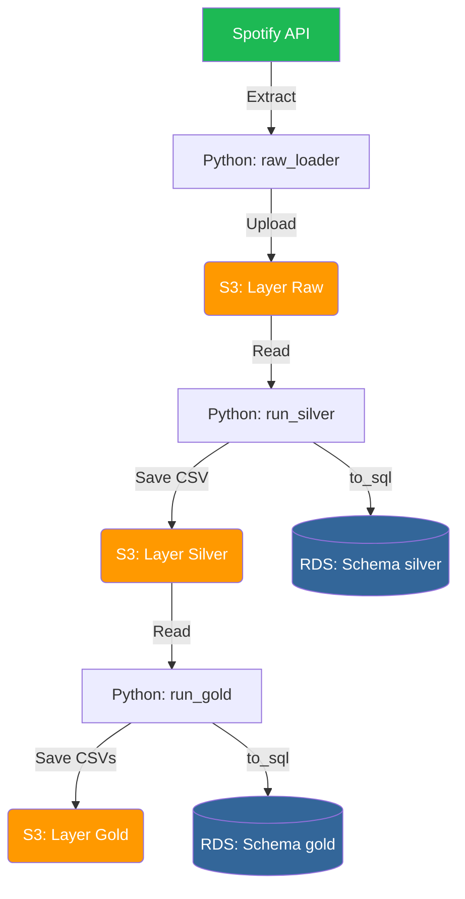

# 🎧 ETL Spotify Cloud – Pipeline End-to-End (AWS S3 & RDS)

## 📌 Visão Geral

Este projeto implementa um pipeline de dados 100% em nuvem utilizando a API do Spotify. A arquitetura segue o padrão Medallion (Raw → Silver → Gold), utilizando serviços da AWS para armazenamento e persistência.

O diferencial deste projeto é a transição de um ambiente local para uma infraestrutura escalável, focando em:
- Data Lake com AWS S3.
- Data Warehouse com AWS RDS (PostgreSQL).
- Processamento Incremental (Idempotência).
- Modelagem Dimensional (Star Schema).

---
## 🏗️ Arquitetura do Pipeline


## 🧠 Tecnologias Utilizadas

- Linguagem: Python 3.11

- Cloud (AWS): S3 (Storage) e RDS (Managed PostgreSQL)

- Bibliotecas: - Pandas (Transformação)

- Boto3 (Integração AWS S3)

- SQLAlchemy (ORM e Conexão com Banco)

- Spotipy / Requests (Consumo de API)

- Modelagem: Arquitetura Medallion e Star Schema.

## 🧱 Estrutura do Projeto

```
etl_spotify/
│
├── src/
│   ├── extract/            # Captura de dados da API
│   ├── load/
│   │   ├── raw/            # Ingestão para S3 Raw
│   │   └── db/             # Scripts de criação de schemas/tabelas
│   ├── transform/
│   │   ├── silver/         # Limpeza e Consolidação (S3 + RDS)
│   │   └── gold/           # Modelagem Star Schema (S3 + RDS)
│   └── pipeline.py         # Orquestrador do fluxo completo
│
├── .env                    # Variáveis de ambiente (AWS/DB)
├── .gitignore              # Proteção de credenciais e dados
└── requirements.txt

```

---

## 🛠️ Camadas de Dados

### 📥 1. Camada Raw (S3)

- Origem: Spotify API (/recently-played).

- Formato: JSON Bruto.

- Armazenamento: Salvo no bucket S3 organizado por data de extração (extraction_date=YYYY-MM-DD/).

- Objetivo: Garantir a imutabilidade dos dados originais para reprocessamento.

### 🥈 2. Camada Silver (S3 + RDS)

- Processamento: O Python lê todos os arquivos JSON do S3, limpa, normaliza e remove duplicatas.

- Incremental: A lógica de merge garante que apenas novas músicas sejam adicionadas.

- Persistência: - Arquivo CSV consolidado no S3 Silver.

- Tabela espelho no RDS PostgreSQL (Schema silver).

### 🥇 3. Camada Gold (S3 + RDS)

- Modelagem: Transformação da tabela única em um modelo Star Schema.

- Tabelas Geradas: - dim_artist, dim_album, dim_track (Dimensões), fact_recently_played (Fato).

- Objetivo: Dados prontos para consumo por ferramentas de BI (Power BI/Tableau) com alta performance de consulta.


## 🚀 Execução do Pipeline
```
python -m src.pipeline
```
#### Fluxo de Execução:

- Valida infraestrutura no RDS (Criação de Schemas).

- Extrai dados novos do Spotify e envia para S3 Raw.

- Processa a Silver, consolidando o histórico no S3 e atualizando o banco.

- Processa a Gold, gerando o modelo dimensional no RDS.

## ⚙️ Configuração do Ambiente (.env)

```
# Spotify
SPOTIFY_CLIENT_ID=...
SPOTIFY_CLIENT_SECRET=...

# AWS
S3_BUCKET_NAME=seu-bucket-spotify
AWS_ACCESS_KEY_ID=...
AWS_SECRET_ACCESS_KEY=...

# RDS / PostgreSQL
DB_HOST=seu-endpoint-rds.aws.com
DB_PORT=5432
DB_NAME=spotify_aws
DB_USER=postgres
DB_PASSWORD=sua_senha
```

## 🧪 Boas Práticas Aplicadas

- Separação clara de responsabilidades
- Código modular e reutilizável
- Uso de variáveis de ambiente
- Versionamento pronto para produção
- Estrutura escalável para novos endpoints
- Pipeline reexecutável (idempotência)


## 🧪 Ambiente Virtual

Criar o ambiente virtual:

```
python -m venv .venv
```

Ativar:

Linux / Mac:
```
source .venv/bin/activate
```

Windows:
```
.venv\Scripts\activate
```

---

## 📦 Instalação das Dependências

```
pip install flask requests python-dotenv
```

---

## 🎯 Competências Demonstradas

- ✔ Cloud Computing: Gerenciamento de serviços AWS (S3 e RDS).
- ✔ Engenharia de Dados: Implementação de arquitetura Medallion.
- ✔ DevOps/Segurança: Uso de .env, .gitignore e boas práticas de credenciais.
- ✔ SQL Avançado: Manipulação de Schemas, Constraints (Cascade/Drop) e Modelagem Dimensional.
- ✔ Python: Manipulação de buffers em memória (io.StringIO) e integração com APIs.

## 👨‍💻 Sobre o Autor

### Jackson Nascimento - Engenheiro de Dados em formação | BI | Analytics


Projeto desenvolvido com foco em aprendizado real de engenharia de dados, indo além de tutoriais e demonstrando capacidade de estruturar pipelines próximos ao cenário profissional.

#### 🔗 LinkedIn: https://www.linkedin.com/in/jackson10/
